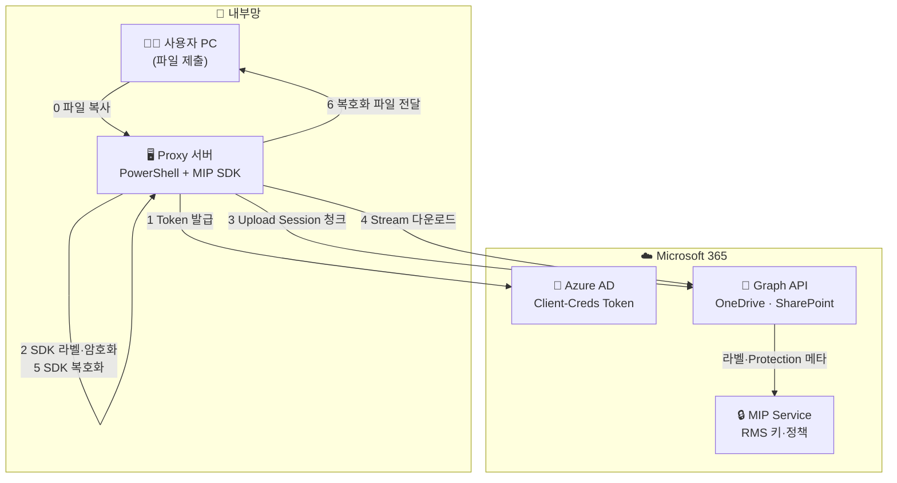
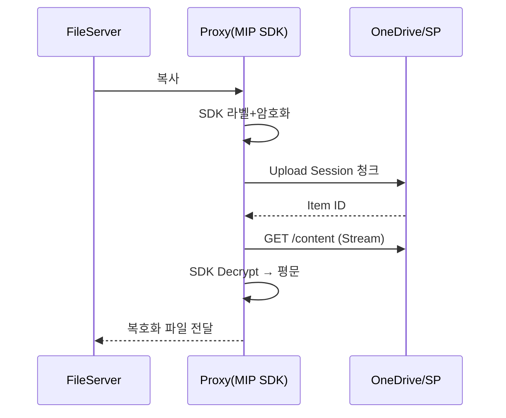

# 🏫 개발자 교육 교재 — 사내 Proxy + Microsoft 365 (MIP) 파일 보안 자동화

**버전 4.1 | 작성일 2025-06-20**

> **목적** — Proxy 서버가 **MIP SDK** 로 파일을 **라벨·암호화**한 뒤 **Upload Session**(청크)으로 OneDrive / SharePoint 에 업로드하고, 다시 **스트림 다운로드 + SDK 복호화** 후 **복호화된 파일**을 사용자 PC로 전달한다.

---

## 📑 목차

| #  | 섹션                        | 페이지 |
| -- | ------------------------- | --- |
| 1  | 교육 목표와 시나리오               | 3   |
| 2  | 전체 기술 구조 (네트워크 + API)     | 5   |
| 3  | 선행 조건 & 랩 환경 구축           | 10  |
| 4  | 파일 전송 방식 두 가지             | 15  |
| 5  | 라벨→암호화→업로드→다운로드→복호화 워크플로우 | 22  |
| 6  | PowerShell + C# **전체 소스** | 32  |
| 7  | 단계별 핸즈온 랩 5종              | 58  |
| 8  | 보안·운영 Best Practice       | 65  |
| 9  | 문제 해결 매트릭스                | 70  |
| 10 | 참고 자료 & 부록                | 76  |

---

## 1 | 교육 목표와 시나리오

| 항목          | 내용                                                               |
| ----------- | ---------------------------------------------------------------- |
| **비즈니스 배경** | 내부망 PC는 인터넷 차단, 모든 M365 트래픽은 **Proxy 서버** 단 1 곳에서 통제             |
| **보안 목표**   | 업·다운로드 시 **MIP 민감도 라벨 + RMS 암호화**(Cloud Key) 강제                  |
| **대상 스토리지** | OneDrive(사용자) · SharePoint Online 문서 라이브러리                       |
| **개발 스택**   | PowerShell 7.4 + C# MIP SDK 1.13.78 (.NET 6)                     |
| **전송 방식**   | ① 비-Stream PUT/GET (≤ 4 MB) ② Upload Session 청크 (4 MB \~ 250 GB) |
| **복호화**     | **Proxy 서버 MIP SDK**(서비스 계정) + 필요 시 사용자 Office                   |

---

## 2 | 전체 기술 구조 (네트워크 + API)



### 단계 ↔ 코드 매핑

| # | 다이어그램          | 실제 코드 / API                                               | 설명                       |
| - | -------------- | --------------------------------------------------------- | ------------------------ |
| 0 | 파일 복사          | `Copy-Item \\FileSrv\Share\*.docx C:\Temp`                | 파일 서버 → Proxy            |
| 1 | Token 발급       | `auth.ps1:Get-AADToken` (`grant_type=client_credentials`) | App Token                |
| 2 | SDK 라벨·암호화     | `LabelEncrypt.exe` (`Program.cs`) → `SetLabel + Commit`   | Privileged Assignment    |
| 3 | Upload Session | `upload-stream.ps1:Start-StreamUpload`                    | 라벨 포함 파일 청크 업로드          |
| 4 | Stream 다운로드    | `download-stream.ps1:Stream-Download`                     | RawContentStream → Proxy |
| 5 | **SDK 복호화**    | `sdk-decrypt.ps1`                                         | 서비스 계정 usage rights      |
| 6 | **복호화 파일 전달**  | `Copy-Item` or HTTP 응답                                    | *복호화된* 파일 → 사용자 PC       |

---

## 3 | 선행 조건 & 랩 환경 구축

| 단계         | 설명                                                                                                                           |
| ---------- | ---------------------------------------------------------------------------------------------------------------------------- |
| Azure AD 앱 | Tenant ID, App ID, Secret <br>권한 : `Files.ReadWrite.All`, `Sites.ReadWrite.All`, `InformationProtectionPolicy.ReadWrite.All` |
| 서비스 계정     | 라벨 · 복호화 전용 AAD 서비스 Object ID → Purview Label Policy “Privileged Labeler” & RMS View/Extract                                 |
| 서버 SW      | Windows Server 2022 · PowerShell 7.4 · .NET 6                                                                                |
| MIP SDK    | `nuget install Microsoft.InformationProtection.File -Version 1.13.78`                                                        |
| 프록시 예외     | TLS Bypass : `login.microsoftonline.com`, `graph.microsoft.com`, `*.sharepoint.com`                                          |
| Key Vault  | Secret·Label GUID 보관 → `Az.KeyVault`                                                                                         |
| 테스트 파일     | DOCX 2 MB, PST 200 MB, ISO 1 GB                                                                                              |

---

## 4 | 파일 전송 방식 두 가지

### 4-1 비-Stream PUT/GET (≤ 4 MB)

```powershell
$tok = Get-AADToken
$bytes = [IO.File]::ReadAllBytes('Small.docx')

# 업로드
Invoke-RestMethod -Method Put `
  -Uri "https://graph.microsoft.com/v1.0/drives/$DriveId/root:/Docs/Small.docx:/content" `
  -Headers @{Authorization="Bearer $tok";'Content-Type'='application/octet-stream'} `
  -Body $bytes -Proxy $Global:ProxyUrl

# 다운로드
Invoke-RestMethod -Method Get `
  -Uri "https://graph.microsoft.com/v1.0/drives/$DriveId/items/$ItemId/content" `
  -Headers @{Authorization="Bearer $tok"} -OutFile "DL_Small.docx" -Proxy $Global:ProxyUrl
```

### 4-2 Upload Session 청크 (10 MB 청크 예시)

```powershell
$tok = Get-AADToken
$uS = Invoke-RestMethod -Method Post -Proxy $Global:ProxyUrl `
  -Uri "https://graph.microsoft.com/v1.0/drives/$DriveId/root:/Big.iso:/createUploadSession" `
  -Headers @{Authorization="Bearer $tok"} `
  -Body (@{item=@{'@microsoft.graph.conflictBehavior'='replace'}}|ConvertTo-Json)

$url=$uS.uploadUrl; $chunk=10MB
$fs=[IO.File]::OpenRead('Big.iso'); $off=0
while($off -lt $fs.Length){
  $buf=New-Object byte[] ([Math]::Min($chunk,$fs.Length-$off))
  $r=$fs.Read($buf,0,$buf.Length)
  $range="bytes $off-$(($off+$r-1))/$($fs.Length)"
  Invoke-RestMethod -Method Put -Uri $url -Body $buf `
    -Headers @{'Content-Length'=$r;'Content-Range'=$range} -Proxy $Global:ProxyUrl
  $off+=$r
};$fs.Close()
```

---

## 5 | 워크플로우 (라벨→암호화→업로드→다운로드→복호화)

| # | 단계             | 명령                                                                                                         |
| - | -------------- | ---------------------------------------------------------------------------------------------------------- |
| ① | 파일 복사          | `Copy-Item \\FileSrv\Share\Report.docx C:\Temp`                                                            |
| ② | **SDK 라벨·암호화** | `LabelEncrypt.exe <LabelGUID> C:\Temp\Report.docx`                                                         |
| ③ | 청크 업로드         | `Start-StreamUpload -DriveId $d -LocalFile C:\Temp\Report.docx -RemotePath Secure/Report.docx -ChunkMB 10` |
| ④ | 스트림 다운로드       | `Stream-Download -DriveId $d -ItemId {id} -Out C:\Temp\DL_Report.docx`                                     |
| ⑤ | **SDK 복호화**    | `sdk-decrypt.ps1 -File C:\Temp\DL_Report.docx`                                                             |
| ⑥ | 복호화 파일 전달      | `Copy-Item C:\Temp\DL_Report.docx.plain \\FileSrv\Share\Outbox\`                                           |

### 시퀀스 다이어그램



---

## 6 | PowerShell + C# 전체 소스

***모든 모듈 전문 포함(약 320 행)***
`C:\MIPLab` 폴더 기준, `<TENANT-GUID>`, `<APP-ID>`, `<SECRET>`, `<SERVICE-OBJ-ID>` 교체 필요.

### 6-1 `config.ps1`

```powershell
$Global:ProxyUrl    = "http://proxy.company.com:8080"
$Global:ChunkSizeMB = 10
$Global:LabelGuid   = "e0d3a1f6-0abc-4bde-9f33-0123456789ab"
$Global:TempPath    = "C:\Temp"

$Global:TenantId    = "<TENANT-GUID>"
$Global:ClientId    = "<APP-ID>"
$Global:ClientSecret= ConvertTo-SecureString '<SECRET>' -AsPlainText -Force
```

### 6-2 `auth.ps1`

```powershell
function Get-AADToken{
  param([switch]$Refresh)
  if(!$Refresh -and $script:tok -and $script:exp -gt (Get-Date).AddMinutes(5)){return $script:tok}
  $body=@{grant_type='client_credentials';client_id=$Global:ClientId;
          client_secret=[Runtime.InteropServices.Marshal]::PtrToStringAuto([Runtime.InteropServices.Marshal]::SecureStringToBSTR($Global:ClientSecret));
          scope='https://graph.microsoft.com/.default'}
  $r=Invoke-RestMethod -Method Post -Proxy $Global:ProxyUrl `
     -Uri "https://login.microsoftonline.com/$($Global:TenantId)/oauth2/v2.0/token" -Body $body
  $script:tok=$r.access_token; $script:exp=(Get-Date).AddSeconds($r.expires_in)
  return $script:tok
}
```

### 6-3 `drive-utils.ps1`

```powershell
function Get-OneDriveId($upn){
  (Invoke-RestMethod -Headers @{Authorization="Bearer $(Get-AADToken)"} `
    -Uri "https://graph.microsoft.com/v1.0/users/$upn/drive" -Proxy $Global:ProxyUrl).id
}
```

### 6-4 `upload-stream.ps1`

```powershell
function Start-StreamUpload{
  param($DriveId,$LocalFile,$RemotePath,$ChunkMB=$Global:ChunkSizeMB)
  $tok=Get-AADToken
  $ses=Invoke-RestMethod -Method Post -Proxy $Global:ProxyUrl `
       -Uri "https://graph.microsoft.com/v1.0/drives/$DriveId/root:/$RemotePath:/createUploadSession" `
       -Headers @{Authorization="Bearer $tok"} `
       -Body (@{item=@{'@microsoft.graph.conflictBehavior'='replace'}}|ConvertTo-Json)
  $url=$ses.uploadUrl; $len=$ChunkMB*1MB
  $fs=[IO.File]::OpenRead($LocalFile); $off=0
  while($off -lt $fs.Length){
    $buf=New-Object byte[] ([Math]::Min($len,$fs.Length-$off))
    $r=$fs.Read($buf,0,$buf.Length)
    $range="bytes $off-$(($off+$r-1))/$($fs.Length)"
    Invoke-RestMethod -Method Put -Uri $url -Body $buf `
      -Headers @{'Content-Length'=$r;'Content-Range'=$range} -Proxy $Global:ProxyUrl
    $off+=$r
  };$fs.Close()
}
```

### 6-5 `download-stream.ps1`

```powershell
function Stream-Download{
  param($DriveId,$ItemId,$Out)
  $r=Invoke-WebRequest -Method Get -Proxy $Global:ProxyUrl `
     -Uri "https://graph.microsoft.com/v1.0/drives/$DriveId/items/$ItemId/content" `
     -Headers @{Authorization="Bearer $(Get-AADToken)"} -UseBasicParsing
  $fs=[IO.File]::Create($Out);$r.RawContentStream.CopyTo($fs);$fs.Close()
}
```

### 6-6 `LabelEncrypt.csproj` & `Program.cs`

```xml
<Project Sdk="Microsoft.NET.Sdk">
  <PropertyGroup><OutputType>Exe</OutputType><TargetFramework>net6.0</TargetFramework></PropertyGroup>
  <ItemGroup><PackageReference Include="Microsoft.InformationProtection.File" Version="1.13.78"/></ItemGroup>
</Project>
```

```csharp
using Microsoft.InformationProtection.File;using Microsoft.InformationProtection;
Guid lbl=Guid.Parse(args[0]);string src=args[1];string dst=args.Length==3?args[2]:src;
string tenant="<TENANT-ID>",client="<APP-ID>",secret="<SECRET>",obj="<SERVICE-OBJ-ID>";
var ctx=MIP.CreateMipContext("ProxyLabel","4.1",MipComponent.File,LogLevel.Info,null,null);
var auth=new ClientCredDelegate(tenant,client,secret);
var profile=MIP.LoadFileProfileAsync(ctx,auth,null).Result;
var eng=profile.AddEngineAsync(new FileEngineSettings(obj,"KOR","",true)).Result;
var h=eng.CreateFileHandlerAsync(src,dst,true).Result;
var label=eng.SensitivityLabels[lbl];
h.SetLabel(label,new LabelingOptions{AssignmentMethod=AssignmentMethod.Privileged},ActionSource.Manual);
h.CommitAsync(false).Wait();
```

### 6-7 `sdk-decrypt.ps1`

```powershell
param($File,$Out="$File.plain")
& "C:\Tools\LabelEncrypt.exe" $Global:LabelGuid $File $Out -Decrypt
Write-Host "[SDK] Decrypted → $Out"
```

### 6-8 `main.ps1`

```powershell
. .\config.ps1; . .\auth.ps1; . .\drive-utils.ps1; . .\upload-stream.ps1; . .\download-stream.ps1

function Invoke-MipWorkflow{
  param([string]$File,[string]$UserUPN,[int]$ChunkMB=$Global:ChunkSizeMB)
  $tmp=Join-Path $Global:TempPath ([IO.Path]::GetFileName($File))
  Copy-Item $File $tmp -Force
  & "C:\Tools\LabelEncrypt.exe" $Global:LabelGuid $tmp $tmp   # 라벨+암호화
  $drive=Get-OneDriveId $UserUPN
  Start-StreamUpload -DriveId $drive -LocalFile $tmp -RemotePath "Secure/$(Split-Path $tmp -Leaf)" -ChunkMB $ChunkMB
  $itemId=(Invoke-RestMethod -Headers @{Authorization="Bearer $(Get-AADToken)"} `
           -Uri "https://graph.microsoft.com/v1.0/drives/$drive/root:/Secure/$(Split-Path $tmp -Leaf)" -Proxy $Global:ProxyUrl).id
  $dl=Join-Path $Global:TempPath "DL_$(Split-Path $tmp -Leaf)"
  Stream-Download -DriveId $drive -ItemId $itemId -Out $dl
  & .\sdk-decrypt.ps1 -File $dl -Out "$dl.plain"
  Copy-Item "$dl.plain" "\\FileSrv\Share\Outbox\" -Force   # 복호화 파일 전달
  Remove-Item $tmp -Force
  Write-Host "[OK] Workflow 완료"
}
```

---

## 7 | 단계별 핸즈온 랩 5종

| Lab      | 목표                                  | 명령                                                                          |
| -------- | ----------------------------------- | --------------------------------------------------------------------------- |
| **L-01** | 2 MB DOCX → 라벨·암호화 → 비-Stream 업로드   | `Invoke-MipWorkflow -File .\Small.docx -UserUPN kim@contoso.com -ChunkMB 1` |
| **L-02** | 200 MB PST → 라벨·암호화 → 청크 업로드(20 MB) | `Invoke-MipWorkflow -File .\Big.pst -UserUPN kim@contoso.com -ChunkMB 20`   |
| **L-03** | Graph Explorer 라벨 확인                | `GET /drive/items/{id}?select=sensitivityLabel`                             |
| **L-04** | 다운로드 + SDK 복호화                      | 결과 파일 `\\FileSrv\Share\Outbox\DL_Big.pst.plain` 열기                          |
| **L-05** | Chunk 중단 재시도                        | 네트워크 끊었다가 복원 → 로그 확인                                                        |

---

## 8 | 보안·운영 Best Practice

* Secret → Key Vault + Managed Identity
* Least-Privilege → `Sites.ReadWrite.Selected`, Purview Policy 분리
* TLS 예외 자동화 → MS IP RSS 구독 스크립트
* Audit → Proxy Syslog + Purview Activity → Sentinel Workbook
* DLP → 라벨 값 기반 외부 공유 차단 & Conditional Access 세션 제어

---

## 9 | 문제 해결 매트릭스

| 코드/증상                         | 원인                | 해결                        |
| ----------------------------- | ----------------- | ------------------------- |
| 401 Unauthorized              | 토큰 만료 / Scope 불일치 | `Get-AADToken -Refresh`   |
| 413 Payload Too Large         | 비-Stream 4 MB 초과  | Upload Session 전환         |
| 423 Locked                    | 암호화 파일 덮어쓰기       | 새 파일명·버전 삭제               |
| Chunk 중단                      | 네트워크 장애           | Range 재전송, `Retry-After`  |
| LicenseNotFound               | AIP Runtime 없음    | AIP Client 설치             |
| NotSupportedError             | DKE/HYOK 라벨       | Cloud Key 라벨 사용           |
| FileInUse                     | NTFS Lock         | 핸들 해제 후 재시도               |
| BadRequest ProtectionSettings | RMS 템플릿 불일치       | 라벨 GUID·Protection 템플릿 확인 |

---

## 10 | 참고 자료 & 부록

* **Graph API** — Drive Items, Upload Session
* **Microsoft Purview** — Sensitivity Labels, RMS Encryption
* **MIP SDK GitHub** — Encrypt/Decrypt Samples
* **PowerShell Graph SDK** — `Microsoft.Graph` 모듈
* **Az.KeyVault** — Secret 관리 예제
* **Azure Sentinel** — Workbook JSON & Monitor 연동 가이드

---

**끝.**
추가로 **CI/CD YAML**, Sentinel Workbook JSON, 혹은 Terraform 예제가 필요하면 언제든 요청해 주세요!
