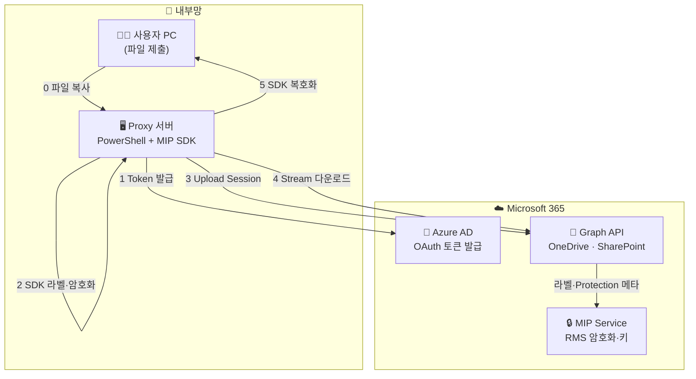
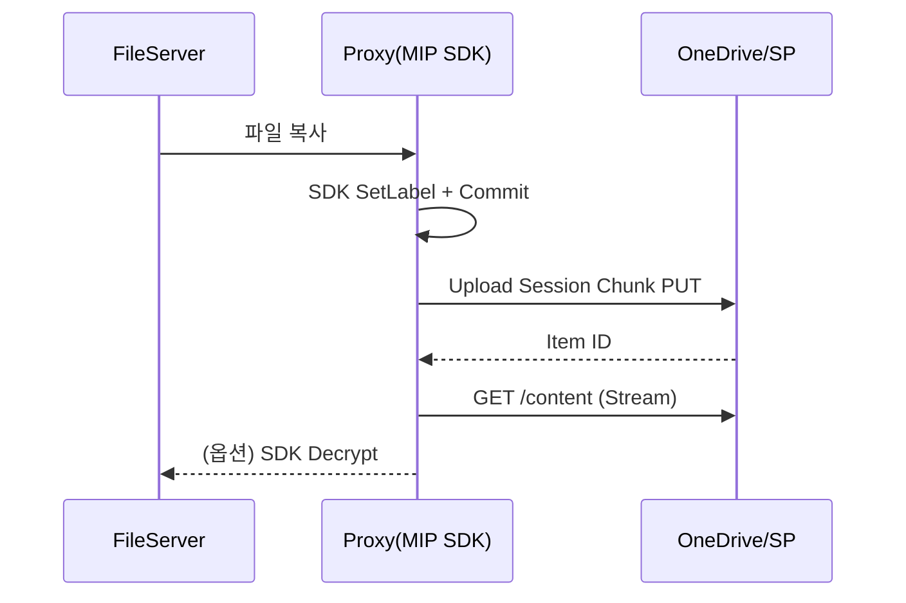

아래는 **“Proxy 서버 + 로컬 MIP SDK 라벨링 → Stream 업로드 → Stream 다운로드”** 전 과정을 빠짐없이 서술 + 전체 코드 포함한 **완전판 교재(v3.3)** 입니다.

> 그대로 복사해 팀 Wiki 또는 PDF로 변환하여 사용하십시오. 실습 환경(Windows Server 2022 · PowerShell 7.4 · .NET 6)에서 바로 빌드·실행 가능합니다.

---

# 🏫 개발자 교육 교재 — 사내 Proxy + Microsoft 365 (MIP) 파일 보안 자동화

**버전 3.3 | 작성일 2025-06-20**

> **목적** — 내부망 Proxy 서버가 **MIP SDK** 로 파일을 라벨·암호화(Cloud Key 기반)한 뒤, **Upload Session(청크)** 으로 OneDrive/SharePoint 에 업로드하고, 다시 **스트림 다운로드·(선택) 복호화**까지 자동화한다.

---

## 📑 목차

| #  | 섹션                                | 페이지 |
| -- | --------------------------------- | --- |
| 1  | 교육 목표와 시나리오                       | 3   |
| 2  | 전체 기술 구조 (네트워크 + API)             | 5   |
| 3  | 선행 조건 & 랩 환경 구축                   | 10  |
| 4  | 파일 전송 방식 두 가지                     | 15  |
| 5  | 로컬 MIP SDK 라벨링 + 업로드 + 다운로드 워크플로우 | 21  |
| 6  | PowerShell + C# **전체 소스**         | 29  |
| 7  | 단계별 핸즈온 랩 5 종                     | 50  |
| 8  | 보안·운영 Best Practice               | 57  |
| 9  | 문제 해결 매트릭스                        | 61  |
| 10 | 참고 자료 & 부록                        | 66  |

---

## 1 | 교육 목표와 시나리오

| 항목          | 내용                                                                       |
| ----------- | ------------------------------------------------------------------------ |
| **비즈니스 배경** | 내부망 PC는 인터넷 차단, 모든 MS 365 트래픽은 **Proxy 서버** 단 1 곳에서 통제                   |
| **보안 목표**   | 업로드·다운로드 시 **MIP 민감도 라벨 + RMS 암호화** 강제 부착 <br>(Cloud Key, 사용자·서비스 권한 제어) |
| **대상 스토리지** | OneDrive(사용자) & SharePoint Online 문서 라이브러리                               |
| **개발 스택**   | PowerShell Core 7.4 스크립트 & C# MIP SDK 1.13.78 (.NET 6)                   |
| **전송 방식**   | ① 비-Stream PUT/GET (≤ 4 MB) <br>② Upload Session 청크 (4 MB \~ 250 GB)     |
| **복호화 경로**  | ▸ 사용자 PC Office 앱(Delegated Token) 자동 <br>▸ Proxy 서버 MIP SDK (서비스 권한)    |

---

## 2 | 전체 기술 구조 (네트워크 + API)

### 2-1 상위 다이어그램



### 2-2 세부 매핑 표

| 단계 | Mermaid 라벨             | 실제 API/모듈                                                                                | 설명                                      |
| -- | ---------------------- | ---------------------------------------------------------------------------------------- | --------------------------------------- |
| 1  | 원본 파일 복사               | `Copy-Item` (파일 서버→Proxy)                                                                | 실습용 SMB/HTTPS 업로드 폴더                    |
| 2  | **Client-Creds Token** | `POST /oauth2/v2.0/token` <br>모듈 `auth.ps1:Get-AADToken`                                 | App ID+Secret ⇒ **Application 토큰**      |
| 3  | MIP SDK 라벨·암호화         | `LabelEncrypt.exe` (C#) → `SetLabel()` + `Commit()`                                      | Privileged Assignment, Cloud Key        |
| 4  | Upload Session         | ① `POST .../createUploadSession` <br>② `PUT {uploadUrl}` (청크) <br>모듈 `upload-stream.ps1` | 이미 라벨 포함 → `assignSensitivityLabel` 불필요 |
| 5  | Stream GET             | `GET /items/{id}/content` + RawContentStream <br>모듈 `download-stream.ps1`                | 메모리 0-복사 다운로드                           |
| 6  | (옵션) SDK 복호화           | `sdk-decrypt.ps1`                                                                        | 서비스 계정 usage rights 포함 필요               |

> **Token** 단계는 사용자 로그인 UI 없이 **머신-대-머신** 인증(Client Credentials)입니다.
> 사용자가 Word/Excel을 열 때는 별도 Delegated Token(Office MSAL)로 RMS usage rights를 자동 획득합니다.

---

## 3 | 선행 조건 & 랩 환경 구축

| 단계             | 내용                                                                                                                                                        |
| -------------- | --------------------------------------------------------------------------------------------------------------------------------------------------------- |
| **Azure AD 앱** | Tenant ID, App ID, Client Secret 발급 <br>API 권한: `Files.ReadWrite.All`, `Sites.ReadWrite.All`, `InformationProtectionPolicy.ReadWrite.All` *(Application)* |
| **서비스 계정**     | 라벨링 전용 AAD 서비스 프린시펄 Object ID <br>Purview 라벨 Policy에 “Privileged Labeler”                                                                                 |
| **서버 SW**      | Windows Server 2022, PowerShell 7.4, .NET 6                                                                                                               |
| **MIP SDK**    | `nuget install Microsoft.InformationProtection.File -Version 1.13.78`                                                                                     |
| **프록시 예외**     | TLS Inspection Bypass: `login.microsoftonline.com`, `graph.microsoft.com`, `*.sharepoint.com`                                                             |
| **Key Vault**  | `Az.KeyVault`로 Secret·Label GUID 보관                                                                                                                       |
| **테스트 파일**     | DOCX 2 MB, PST 200 MB, ISO 1 GB 이상                                                                                                                        |

---

## 4 | 파일 전송 방식 두 가지

### 4-1 비-Stream PUT/GET (≤ 4 MB)

```powershell
$tok = Get-AADToken
$bytes = [IO.File]::ReadAllBytes('Small.docx')

Invoke-RestMethod -Method Put `
  -Uri "https://graph.microsoft.com/v1.0/drives/$DriveId/root:/Docs/Small.docx:/content" `
  -Headers @{Authorization="Bearer $tok";'Content-Type'='application/octet-stream'} `
  -Body $bytes -Proxy $Global:ProxyUrl

Invoke-RestMethod -Method Get `
  -Uri "https://graph.microsoft.com/v1.0/drives/$DriveId/items/$ItemId/content" `
  -Headers @{Authorization="Bearer $tok"} `
  -OutFile "DL_Small.docx" -Proxy $Global:ProxyUrl
```

### 4-2 Upload Session 청크 (4 MB \~ 250 GB)

```powershell
$tok = Get-AADToken
$session = Invoke-RestMethod -Method Post `
  -Uri "https://graph.microsoft.com/v1.0/drives/$DriveId/root:/Big.iso:/createUploadSession" `
  -Headers @{Authorization="Bearer $tok"} `
  -Body (@{item=@{'@microsoft.graph.conflictBehavior'='replace'}}|ConvertTo-Json) -Proxy $Global:ProxyUrl

$url=$session.uploadUrl; $chunk=10MB
$fs=[IO.File]::OpenRead('Big.iso');$off=0
while($off -lt $fs.Length){
  $buf=New-Object byte[] ([Math]::Min($chunk,$fs.Length-$off))
  $read=$fs.Read($buf,0,$buf.Length)
  $range="bytes $off-$(($off+$read-1))/$($fs.Length)"
  Invoke-RestMethod -Method Put -Uri $url -Body $buf `
    -Headers @{'Content-Length'=$read;'Content-Range'=$range} -Proxy $Global:ProxyUrl
  $off+=$read
};$fs.Close()
```

**스트림 다운로드** 코드는 `download-stream.ps1` 전체 소스(섹션 6-6)에 포함.

---

## 5 | 로컬 MIP SDK 라벨링 + 업로드 + 다운로드 워크플로우

### 5-1 단계 표

| 단계 | 세부 작업                  | 스크립트/툴                                            |
| -- | ---------------------- | ------------------------------------------------- |
| 1  | 파일 서버 → Proxy 임시 폴더 복사 | `Copy-Item \\FileSrv\\Share\\Doc.docx C:\\Temp`   |
| 2  | **SDK 라벨·암호화** Commit  | `LabelEncrypt.exe <LabelGUID> C:\\Temp\\Doc.docx` |
| 3  | Upload Session 청크 업로드  | `Start-StreamUpload` (10 MB)                      |
| 4  | Stream 다운로드            | `Stream-Download -DriveId … -ItemId …`            |
| 5  | (옵션) SDK 복호화           | `sdk-decrypt.ps1 -File DL.docx`                   |

### 5-2 Mermaid 시퀀스



---

## 6 | PowerShell + C# **전체 소스**

> 모든 파일은 **`C:\\MIPLab`** 에 저장 후 `pwsh` 실행. **Tenant/Secret/ObjectID** 교체 필수.

### 6-1 `config.ps1`

```powershell
$Global:ProxyUrl    = "http://proxy.company.com:8080"
$Global:ChunkSizeMB = 10
$Global:LabelGuid   = "e0d3a1f6-0abc-4bde-9f33-0123456789ab"
$Global:TempPath    = "C:\\Temp"

$Global:TenantId    = "<TENANT-GUID>"
$Global:ClientId    = "<APP-ID>"
$Global:ClientSecret= ConvertTo-SecureString '<SECRET>' -AsPlainText -Force
```

### 6-2 `auth.ps1`

```powershell
function Get-AADToken{
  param([switch]$Refresh)
  if(!$Refresh -and $script:tok -and $script:exp -gt (Get-Date).AddMinutes(5)){return $script:tok}
  $body=@{
    grant_type='client_credentials'
    client_id=$Global:ClientId
    client_secret=[Runtime.InteropServices.Marshal]::PtrToStringAuto([Runtime.InteropServices.Marshal]::SecureStringToBSTR($Global:ClientSecret))
    scope='https://graph.microsoft.com/.default'
  }
  $res=Invoke-RestMethod -Method Post -Uri "https://login.microsoftonline.com/$($Global:TenantId)/oauth2/v2.0/token" -Body $body -Proxy $Global:ProxyUrl
  $script:tok=$res.access_token
  $script:exp=(Get-Date).AddSeconds($res.expires_in)
  return $script:tok
}
```

### 6-3 `drive-utils.ps1`

```powershell
function Get-OneDriveId($upn){
  (Invoke-RestMethod -Headers @{Authorization="Bearer $(Get-AADToken)"} `
    -Uri "https://graph.microsoft.com/v1.0/users/$upn/drive" -Proxy $Global:ProxyUrl).id
}
function Get-SPDriveId($siteUrl,$lib){
  $site=(Invoke-RestMethod -Headers @{Authorization="Bearer $(Get-AADToken)"} `
         -Uri "https://graph.microsoft.com/v1.0/sites/$siteUrl" -Proxy $Global:ProxyUrl).id
  (Invoke-RestMethod -Headers @{Authorization="Bearer $(Get-AADToken)"} `
     -Uri "https://graph.microsoft.com/v1.0/sites/$site/drives" -Proxy $Global:ProxyUrl).value |
     Where-Object name -eq $lib | Select-Object -Expand id
}
```

### 6-4 `upload-simple.ps1`

```powershell
function Upload-SmallFile{
  param($DriveId,$Remote,$Local)
  $bytes=[IO.File]::ReadAllBytes($Local)
  Invoke-RestMethod -Method Put `
    -Uri "https://graph.microsoft.com/v1.0/drives/$DriveId/root:/$Remote:/content" `
    -Headers @{Authorization="Bearer $(Get-AADToken)";'Content-Type'='application/octet-stream'} `
    -Body $bytes -Proxy $Global:ProxyUrl
}
```

### 6-5 `upload-stream.ps1`

```powershell
function Start-StreamUpload{
  param($DriveId,$LocalFile,$RemotePath,$ChunkMB=$Global:ChunkSizeMB)
  $tok=Get-AADToken
  $uS=Invoke-RestMethod -Method Post -Proxy $Global:ProxyUrl `
       -Uri "https://graph.microsoft.com/v1.0/drives/$DriveId/root:/$RemotePath:/createUploadSession" `
       -Headers @{Authorization="Bearer $tok"} `
       -Body (@{item=@{'@microsoft.graph.conflictBehavior'='replace'}}|ConvertTo-Json)
  $url=$uS.uploadUrl; $sz=$ChunkMB*1MB
  $fs=[IO.File]::OpenRead($LocalFile); $off=0
  while($off -lt $fs.Length){
    $buf=New-Object byte[] ([Math]::Min($sz,$fs.Length-$off))
    $read=$fs.Read($buf,0,$buf.Length)
    $range="bytes $off-$(($off+$read-1))/$($fs.Length)"
    Invoke-RestMethod -Method Put -Uri $url -Body $buf `
      -Headers @{'Content-Length'=$read;'Content-Range'=$range} -Proxy $Global:ProxyUrl
    $off+=$read
  };$fs.Close()
}
```

### 6-6 `download-stream.ps1`

```powershell
function Stream-Download{
  param($DriveId,$ItemId,$Out)
  $r=Invoke-WebRequest -Method Get -Proxy $Global:ProxyUrl `
     -Uri "https://graph.microsoft.com/v1.0/drives/$DriveId/items/$ItemId/content" `
     -Headers @{Authorization="Bearer $(Get-AADToken)"} -UseBasicParsing
  $fs=[IO.File]::Create($Out);$r.RawContentStream.CopyTo($fs);$fs.Close()
}
```

### 6-7 `LabelEncrypt.csproj`

```xml
<Project Sdk="Microsoft.NET.Sdk">
  <PropertyGroup>
    <OutputType>Exe</OutputType>
    <TargetFramework>net6.0</TargetFramework>
  </PropertyGroup>
  <ItemGroup>
    <PackageReference Include="Microsoft.InformationProtection.File" Version="1.13.78"/>
  </ItemGroup>
</Project>
```

### 6-7 `Program.cs`

```csharp
using Microsoft.InformationProtection.File;using Microsoft.InformationProtection;
Guid labelId = Guid.Parse(args[0]);
string src = args[1];
string dst = args.Length==3? args[2] : src;

string tenant = "<TENANT-ID>";
string client = "<APP-ID>";
string secret = "<SECRET>";
string objectId = "<SERVICE-OBJ-ID>";   // 라벨링 서비스 계정

var ctx = MIP.CreateMipContext("ProxyLabelApp","3.3",MipComponent.File,LogLevel.Info,null,null);
var auth = new ClientCredDelegate(tenant,client,secret);
var profile = MIP.LoadFileProfileAsync(ctx,auth,null).Result;
var engine = profile.AddEngineAsync(new FileEngineSettings(objectId,"KOR","",true)).Result;

var handler = engine.CreateFileHandlerAsync(src,dst,true).Result;
var label = engine.SensitivityLabels[labelId];
handler.SetLabel(label,new LabelingOptions{AssignmentMethod=AssignmentMethod.Privileged},ActionSource.Manual);
handler.CommitAsync(false).Wait();
```

### 6-8 `sdk-decrypt.ps1`

```powershell
param($File,$Out="$File.plain")
& "C:\\Tools\\LabelEncrypt.exe" $Global:LabelGuid $File $Out -Decrypt
Write-Host "Decrypted → $Out"
```

### 6-9 `main.ps1`

```powershell
. .\\config.ps1
. .\\auth.ps1
. .\\drive-utils.ps1
. .\\upload-simple.ps1
. .\\upload-stream.ps1
. .\\download-stream.ps1

function Invoke-MipWorkflow{
  param(
    [string]$File,
    [string]$UserUPN,
    [ValidateSet('simple','sdkStream')][string]$Mode='sdkStream',
    [int]$ChunkMB=$Global:ChunkSizeMB
  )
  $tmp = Join-Path $Global:TempPath ([IO.Path]::GetFileName($File))
  Copy-Item $File $tmp -Force
  & "C:\\Tools\\LabelEncrypt.exe" $Global:LabelGuid $tmp $tmp   # SDK 라벨+암호화

  $drive = Get-OneDriveId $UserUPN
  if($Mode -eq 'sdkStream'){
      Start-StreamUpload -DriveId $drive -LocalFile $tmp -RemotePath "Secure/$(Split-Path $tmp -Leaf)" -ChunkMB $ChunkMB
  }else{
      Upload-SmallFile -DriveId $drive -Remote "Docs/$(Split-Path $tmp -Leaf)" -Local $tmp
  }
  Remove-Item $tmp -Force
  Write-Host "[✔] $Mode 업로드 완료"
}
```

---

## 7 | 단계별 핸즈온 랩 5 종

| Lab      | 목표                        | 명령                                                                             |
| -------- | ------------------------- | ------------------------------------------------------------------------------ |
| **L-01** | 2 MB DOCX 비-Stream 업로드+라벨 | `Invoke-MipWorkflow -File .\\Small.docx -Mode simple -UserUPN kim@contoso.com` |
| **L-02** | 200 MB PST Stream 업로드+라벨  | `Invoke-MipWorkflow -File .\\Big.pst -UserUPN kim@contoso.com -ChunkMB 20`     |
| **L-03** | Graph Explorer 라벨 확인      | `GET /drive/items/{id}?select=sensitivityLabel`                                |
| **L-04** | Stream 다운로드 → Word 복호화    | `Stream-Download -DriveId … -ItemId … -Out C:\\Temp\\DL.docx`                  |
| **L-05** | SDK 복호화 검증                | `.\sdk-decrypt.ps1 -File C:\\Temp\\DL.docx`                                    |

---

## 8 | 보안·운영 Best Practice

1. **비밀 보호** → Azure Key Vault + Managed Identity
2. **Least Privilege** → `Sites.ReadWrite.Selected`, Purview 정책 분리
3. **TLS 변동** → MS IP RSS 구독하여 프록시 ACL 자동 갱신
4. **감사 로그** → Proxy Syslog + Purview Activity → Sentinel Workbook
5. **DLP** → 라벨 값 기반 외부 공유 차단, Conditional Access 세션 제어

---

## 9 | 문제 해결 매트릭스

| 코드/증상                         | 원인                | 해결                          |
| ----------------------------- | ----------------- | --------------------------- |
| 401 Unauthorized              | 토큰 만료 / Scope 불일치 | `Get-AADToken -Refresh`     |
| 413 Payload Too Large         | 비-Stream 4 MB 초과  | Upload Session 전환           |
| 423 Locked                    | 암호화 파일 덮어쓰기       | 다른 파일명 or 이전 버전 삭제          |
| Chunk 중단                      | 네트워크 장애           | Range 재전송, `Retry-After` 준수 |
| LicenseNotFound               | AIP Runtime 누락    | AIP Client 설치               |
| NotSupportedError             | DKE/HYOK 라벨       | Cloud Key 라벨 사용             |
| FileInUse                     | NTFS Lock         | 핸들 해제 후 재시도                 |
| BadRequest ProtectionSettings | RMS 템플릿 불일치       | 라벨 GUID·Protection 템플릿 확인   |

---

## 10 | 참고 자료 & 부록

* **Graph API** — Drive Items, Upload Session
* **Microsoft Purview** — Sensitivity Labels · RMS Encryption
* **MIP SDK GitHub** — Encrypt/Decrypt Samples
* **PowerShell Graph SDK** — `Microsoft.Graph` 모듈
* **Az.KeyVault** — Secret 관리 예제
* **Azure Sentinel** — Workbook JSON & Monitor 연동 가이드

---

### ⏹ 끝
