## 🏫 개발자 교육 교재 — 사내 Proxy + Microsoft 365 (MIP) 파일 보안 자동화

**버전 1.2  |  작성일 2025-06-20**

---

### 목차

1. 교육 목표와 시나리오
2. 전체 기술 구조 (네트워크 + API) — Mermaid 다이어그램
3. 선행 조건 & 랩 환경 구축
4. 파일 전송 방식 두 가지
   4-1 비-Stream(단일 PUT/GET)   4-2 Stream(Upload Session/Chunk)
5. MIP 라벨링 워크플로우
6. PowerShell 코드베이스 상세 해설
7. 단계별 핸즈온 랩 5종
8. 보안·운영 베스트 프랙티스
9. 문제 해결 매트릭스
10. 참고 자료 & 부록

---

## 1. 교육 목표와 시나리오

| 항목           | 내용                                                         |
| ------------ | ---------------------------------------------------------- |
| **비즈니스 배경**  | 내부망 PC는 인터넷 차단, 모든 클라우드 트래픽은 중앙 Proxy 서버 단 1 곳에서 제어        |
| **보안 요구**    | 업로드/다운로드 시 **MIP 민감도 라벨**을 강제 부착하고, 암호화 (Protection) 적용    |
| **기술 범위**    | OneDrive (개인 드라이브) & SharePoint Online 문서 라이브러리            |
| **개발 언어**    | PowerShell Core 7.x ― 모든 단계 스크립트화 & 로깅/재시도 내장              |
| **전송 방식**    | ① 비-Stream(≤4 MB)  ② Stream Upload Session(4 MB \~ 250 GB) |
| **복호화 시나리오** | Office 앱(사용자 토큰) 또는 Proxy 서버(MIP SDK)에서 선택 복호화             |

---

## 2. 전체 기술 구조 (Network + API)

```mermaid
flowchart LR
    subgraph LAN["🏢 내부망"]
        PC["👩‍💻 사용자 PC<br/>(파일 제출)"]
        PROXY["🖥️ Proxy 서버<br/>PowerShell Engine"]
    end

    subgraph Cloud["☁️ Microsoft 365 테넌트"]
        AAD["🔐 Azure AD<br/>OAuth 토큰 발급"]
        DRIVE["📁 Graph API<br/>OneDrive·SharePoint"]
        MIP["🔒 MIP 서비스<br/>RMS 암호화"]
    end

    %% 흐름
    PC --> PROXY
    PROXY -- "1️⃣ Token 요청" --> AAD
    PROXY -- "2️⃣ 업로드<br/>(PUT 또는 Upload Session)" --> DRIVE
    PROXY -- "3️⃣ assignSensitivityLabel" --> DRIVE
    DRIVE -- "라벨 · 암호화 메타" --> MIP
    PROXY -- "4️⃣ 다운로드<br/>(GET 또는 Stream)" --> DRIVE
    PROXY -- "5️⃣ (선택) SDK 복호화" --> PC
```



---

## 3. 선행 조건 & 랩 환경 구축

| 단계                   | 설명                                                                                                                         |
| -------------------- | -------------------------------------------------------------------------------------------------------------------------- |
| **Azure AD 앱 등록**    | *App ID / Secret / Tenant ID* 확보, 권한: `Files.ReadWrite.All`, `Sites.ReadWrite.All`, `InformationProtectionPolicy.Read.All` |
| **Protected API 승인** | Graph 관리 센터 → **assignSensitivityLabel** Metered API 등록                                                                    |
| **Proxy 방화벽 예외**     | `login.microsoftonline.com`, `graph.microsoft.com`, `*.sharepoint.com` TLS Inspection Bypass                               |
| **PowerShell 준비**    | Windows Server 2022 또는 Ubuntu 20.04 + PowerShell 7.x                                                                       |
| **Key Vault(권장)**    | Client Secret 및 라벨 GUID 암호 저장                                                                                              |
| **테스트 파일**           | 2 MB Word / 200 MB PST / 1 GB ISO 등 최소 3종                                                                                  |

---

## 4. 파일 전송 방식 두 가지

### 4-1 비-Stream (단일 PUT/GET)

*권장 크기 ≤ 4 MB (일반적으로 30 MB 까지는 동작하나 MS 권장치는 4 MB)*

```powershell
# 업로드
$bytes  = [IO.File]::ReadAllBytes("Small.docx")
Invoke-RestMethod -Uri "$Graph/drives/$DriveId/root:/Docs/Small.docx:/content" `
                  -Method PUT -Headers @{Authorization="Bearer $tok";'Content-Type'='application/octet-stream'} `
                  -Body $bytes

# 다운로드
Invoke-RestMethod -Uri "$Graph/drives/$DriveId/items/$ItemId/content" `
                  -Headers @{Authorization="Bearer $tok"} -OutFile ".\Small.docx"
```

**장점** 간단·1회 요청   **단점** 메모리 사용↑, 대용량 불가

---

### 4-2 Stream Upload Session (청크 방식)

*4 MB 초과 \~ 250 GB, 5–60 MB Chunk 권장*

```powershell
# 세션 생성
$session = Invoke-RestMethod -Uri "$Graph/drives/$DriveId/root:/Big.iso:/createUploadSession" `
          -Headers @{Authorization="Bearer $tok"} -Method POST `
          -Body (@{item=@{ '@microsoft.graph.conflictBehavior'='replace' }} | ConvertTo-Json)
$uUrl = $session.uploadUrl

# 청크 전송
$chunk = 10MB; $fs=[IO.File]::OpenRead("Big.iso"); $off=0
while($off -lt $fs.Length){
    $buf = New-Object byte[] ([Math]::Min($chunk,$fs.Length-$off))
    $read = $fs.Read($buf,0,$buf.Length)
    $range="bytes $off-$(($off+$read-1))/$($fs.Length)"
    Invoke-RestMethod -Uri $uUrl -Method PUT -Body $buf `
        -Headers @{"Content-Length"=$read;"Content-Range"=$range}
    $off += $read
}
$fs.Close()
```

**장점** 메모리 최소화·재시도 용이   **단점** 코드 복잡·세션 관리 필요

---

## 5. MIP 라벨링 워크플로우

1. **업로드 완료** → 파일 `itemId` 확보
2. **assignSensitivityLabel** POST

   ```json
   {
     "sensitivityLabelId": "e0d3-…",
     "assignmentMethod": "standard",
     "justificationText": "자동 라벨"
   }
   ```
3. **HTTP 202** → `Location` 헤더 URL 폴링(`status=completed`)
4. **라벨·Protection** 메타데이터 확인
   `GET /items/{id}?select=name,sensitivityLabel`

---

## 6. PowerShell 코드베이스 상세

| 모듈                      | 주요 함수                             | 포인트                                 |
| ----------------------- | --------------------------------- | ----------------------------------- |
| **config.ps1**          | –                                 | 프록시 URL, Chunk Size, 라벨 GUID, 경로 상수 |
| **auth.ps1**            | `Get-AADToken`                    | 토큰 캐싱(만료 5 분 전 자동 갱신)               |
| **drive-utils.ps1**     | `Get-OneDriveId`, `Get-SPDriveId` | UPN·Site URL → Drive ID 조회          |
| **upload-simple.ps1**   | `Upload-SmallFile`                | 비-Stream PUT                        |
| **upload-stream.ps1**   | `Start-StreamUpload`              | Upload Session + Range 루프           |
| **apply-label.ps1**     | `Apply-MipLabel`                  | 202 → 폴링 → 로그                       |
| **download-simple.ps1** | `Download-SmallFile`              | OutFile                             |
| **download-stream.ps1** | `Stream-Download`                 | RawContentStream.CopyTo()           |
| **main.ps1**            | `Invoke-MipWorkflow`              | 파라미터 파싱, 예외/재시도, 감사 JSON 작성         |

---

## 7. 단계별 핸즈온 랩

| Lab ID   | 실습 목표                           | 실행 예시                                                                                                                            |
| -------- | ------------------------------- | -------------------------------------------------------------------------------------------------------------------------------- |
| **L-01** | 2 MB Word 비-Stream 업로드 & 라벨     | `.\main.ps1 -mode simple -target OneDrive -user kim@co.com -file .\Small.docx`                                                   |
| **L-02** | 200 MB PST 스트림 업로드 & 라벨         | `.\main.ps1 -mode stream -target SharePoint -site https://contoso.sharepoint.com/sites/Team -lib Docs -file .\Big.pst -chunk 20` |
| **L-03** | 라벨 메타데이터 확인                     | Graph Explorer `GET /items/{id}?select=sensitivityLabel`                                                                         |
| **L-04** | 암호화 파일 스트림 다운로드 & Office 자동 복호화 | `.\download-stream.ps1 -drive ... -item ...`                                                                                     |
| **L-05** | MIP SDK로 서버 측 복호화(선택)           | `.\sdk-decrypt.ps1 -file .\Big.pst`                                                                                              |

---

## 8. 보안·운영 베스트 프랙티스

1. **Client Secret 보호** → 환경 변수 or Azure Key Vault
2. **Least-Privilege** → `Sites.ReadWrite.Selected` 적용 가능 시 채택
3. **TLS Inspection 예외** → Graph & Login 도메인 bypass
4. **Metered API 할당량** 모니터링 (라벨 부착 과다 호출 시 스로틀)
5. **Proxy Audit + Purview 활동 탐색기** 통합 대시보드 구축
6. **DLP 정책** → 라벨 값에 따라 외부 공유 자동 차단

---

## 9. 문제 해결 매트릭스

| 증상/코드                     | 원인                       | 해결 가이드                         |
| ------------------------- | ------------------------ | ------------------------------ |
| **401 Unauthorized**      | 토큰 만료·Scope 불일치          | 토큰 재발급, 앱 권한 확인                |
| **403 assignLabel**       | Metered API 미승인/라벨 권한 부족 | Graph Portal 등록, Purview 정책 수정 |
| **413 Payload Too Large** | 비-Stream 4 MB 초과         | Upload Session (Stream) 전환     |
| **423 Locked**            | 암호화 파일 덮어쓰기              | 새 파일명 사용 또는 이전 버전 삭제           |
| **Chunk 중단**              | 네트워크 오류                  | Range 재전송, `Retry-After` 헤더 준수 |

---

## 10. 참고 자료 & 부록

* **Graph API** : Upload Session, Drive Items, assignSensitivityLabel
* **Microsoft Purview** : Sensitivity Labels & Protection
* **MIP SDK GitHub** 샘플 : C# / PowerShell 복호화 예제
* **PowerShell SDK** : `Microsoft.Graph` 모듈, `Az.KeyVault`

---

> 이 문서는 **슬라이드·PDF·Confluence Wiki** 에 그대로 게시할 수 있도록 **한글 설명 + 코드 + 표 + Mermaid**를 포함해 최대한 상세히 구성했습니다.
> **추가 요청** (예: CI/CD 파이프라인 샘플, SDK 복호화 스크립트 풀버전, PDF 변환 등)이 필요하시면 알려주세요!
